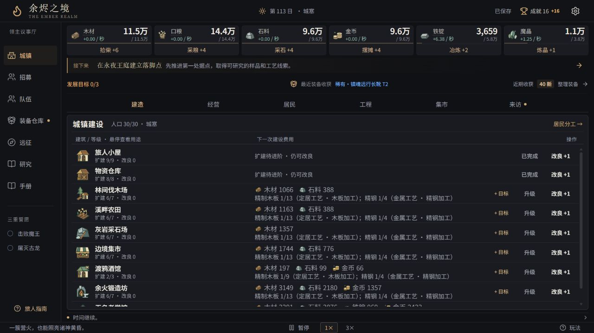
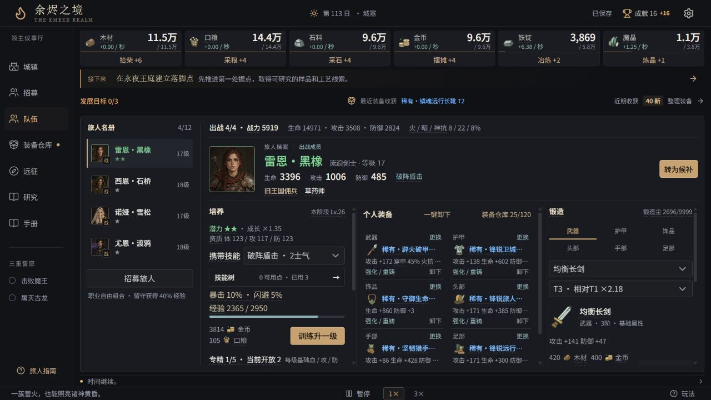
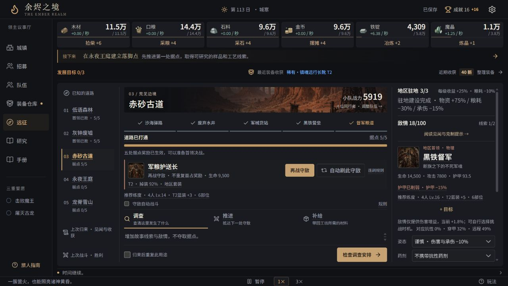
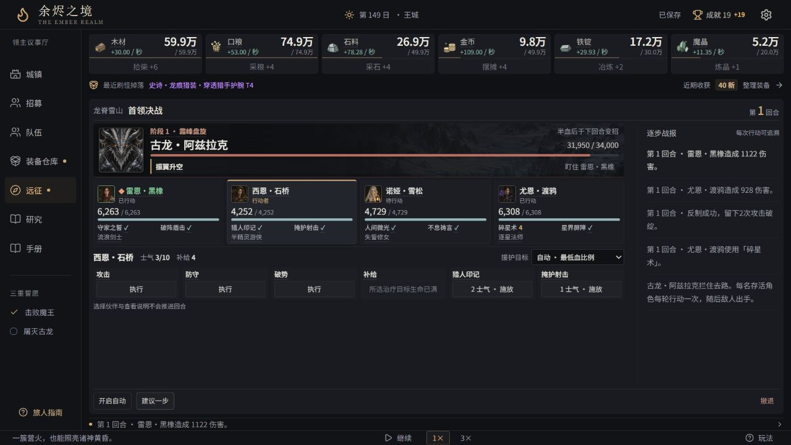

# 余烬之境 · The Ember Realm

**V0.2.2** · 中文西幻增量文字游戏 · MIT

### [⬇ 下载游戏 · Windows 免安装版](https://github.com/x-llsg/ember-realm/releases/latest/download/ember-realm-windows-portable.zip)

**下载 → 完整解压 → 双击「启动余烬之境.exe」即可游玩。无需安装任何开发工具。**

[最新版本与更新说明](https://github.com/x-llsg/ember-realm/releases/latest) · [反馈问题](https://github.com/x-llsg/ember-realm/issues)

你在陌生世界醒来，身边只有一簇将熄的营火。

拾柴、建造小屋、接纳流民，逐渐建立城镇。雇佣有不同潜力、出身与天赋的冒险者，安排生产、研究、锻造与远征，最终挑战魔王、古龙与诸神。

## 游戏实机

以下为 **V0.2.2 实际游戏页面**，展示不同的发展进度。

**城镇经营**



从采集和建设起步，扩建城镇，为研究、锻造与出征积累物资。

**队伍养成**



在同一页切换旅人、培养角色、调整六个装备部位并锻造装备。

<details>
<summary>查看远征地图与首领战斗</summary>

**远征地图**



选择已发现的地图与据点，准备出征，也能返回已经击败的守敌刷取装备。

**首领战斗**



观察敌人的行动意图与各角色的生命、技能冷却，选择手动操作或自动战斗。

</details>

## 游玩

使用上方「下载游戏」获取成品包，完整解压后双击「启动余烬之境.exe」或「启动余烬之境.cmd」。macOS / Linux 玩家也可用现代浏览器打开包内 ember-realm/play.html。游戏可以离线运行。

GitHub 的绿色 Code → Download ZIP 按钮下载的是源代码；直接游玩请使用上方的免安装包。

游戏保存在当前浏览器本地，操作后自动保存，支持离线结算。**更新步骤：旧版设置中「导出手记」→ 关闭旧页面 → 解压并启动新版 → 在设置中「导入手记」。** 更换浏览器、设备或解压目录时也这样迁移。当前存档格式为 v10，兼容历史版本存档。

发行页只保留最新版游戏包。源代码提交记录保留，便于查看修改与贡献代码。

## 已有内容

- 手绘风格的职业头像、六章守敌与首领图鉴，资源、建筑、装备图标；全部配图支持离线游玩。
- 从手动采集开始，随着发展逐步开放资源、建筑、研究和城镇经营。
- 居民分工、材料加工、地区运输、订单、留守任职与临时来访。
- 随机冒险者、五档潜力、出身与利弊统一的分级天赋，自由组合职业。
- 九职业三分支技能树，有限技能点与多项携带技能。
- 六装备槽、白绿蓝紫金红品质、地区套装、强化与定向重铸。
- 六个地区、三十个据点守敌、六位有阶段机制的首领。
- 独立生命与技能冷却的回合战斗，支持手动、自动、随时撤退。
- 同一个世界持续经营、配装与战后重建。
- 发展目标合计物资需求；六章替代配方、可补建的地区工程及套装战斗联动。

游戏仍在持续开发，后续版本会继续调整内容、体验和数值。

## 本地开发

需要 Node.js 22.13+ 与 npm。

```bash
npm ci
npm run dev
```

打开终端显示的本地地址，默认 http://127.0.0.1:3001 。

```bash
npm test                # 游戏规则与旧档兼容测试
npm run typecheck      # TypeScript 检查
npm run build          # 网页静态文件，输出 dist/
npm start              # 预览网页构建
npm run build:portable # 生成完全自包含的 play.html
```

Windows 还可运行 `npm run build:release`，生成带启动器的免安装压缩包。启动器源码在 scripts/launcher.cs，打包脚本使用系统 .NET Framework 编译器；非 Windows 可使用 play.html。

## 项目结构

- app/、components/、hooks/：界面与交互。
- lib/：存档、经营、地图、招募、装备、技能与战斗规则。
- scripts/：回归测试与发行工具。
- public/：游戏图片与图标。

纯前端应用，无需后端服务或私有托管账号。开发设计稿、内部数值推演和规划不包含在公开仓库内。

## 反馈与授权

欢迎通过 Issues 提交问题。请附游戏版本、复现步骤与必要的截图；上传存档前先确认其中没有你不希望公开的内容。

本仓库原创代码和资源使用 [MIT 许可证](LICENSE)。依赖组件保留各自许可证。内置中文字体来自 [Noto Sans SC](https://github.com/google/fonts/tree/main/ofl/notosanssc)，按 [SIL OFL 1.1](public/fonts/OFL.txt) 分发；已按游戏文字制作子集，随免安装网页内嵌，无需联网。版本变更见 [CHANGELOG.md](CHANGELOG.md)。

新增中文文案若触发字体覆盖检查，可安装开发工具 `fonttools[woff]` 后，运行 `python scripts/subset-ui-font.py NotoSansSC.ttf` 重建子集。普通构建及玩家启动不需要 Python。
